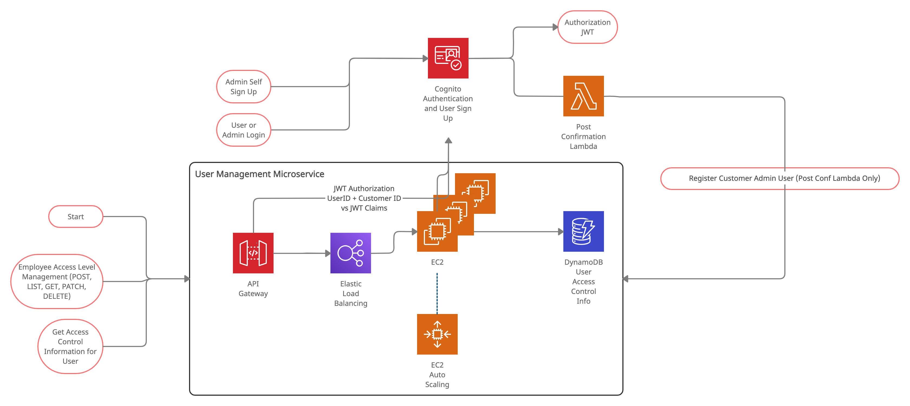

# User Management Service

## Architecture Diagram


## Access Levels
***Admin***

***Users***

## Endpoints
### **User Access Level Endpoint**
**Endpoint:**
```
/[customer_id]/[user_id]
```

**Methods**
```
GET, PATCH, DELETE
```

**Response:**
```json
{
  "UserID": "[user_id]",
  "CustomerID": "[customer_id]",
  "AccessLevel": "[access_level]",
}
```

### **Customer Level Access Levels**
**Endpoint:**
```
/[customer_id]
```

**Methods**
```
POST, LIST
```

**Response:**
```json
{
  "Users": [
    {
      "UserID": "[user_id]",
      "AccessLevel": "[access_level]",
    },...
  ]
}
```
